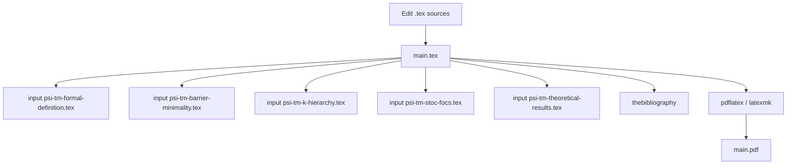

<!-- Copyright (c) 2025 Rafig Huseynzade. All Rights Reserved. -->
<!-- Licensed under CC BY-NC-ND 4.0 -->
<!-- Original work - do not copy without attribution -->

# Psi-TM — Minimal-introspection Turing machine model (LaTeX)


### Overview
- **What**: LaTeX sources for the Psi‑Turing Machine (Psi‑TM) model: formal definitions, k‑limited introspection, hierarchy, and conservative barrier analysis.
- **Who**: Researchers and practitioners in theoretical computer science and complexity theory.
- **Key ideas**:
  - Constant‑depth introspection \(k = O(1)\) with selectors‑only semantics.
  - Explicit information‑budget lemmas and conservative statements (oracle‑relative/partial where appropriate).
  - Strict k‑hierarchy constructions and complexity class relationships.
- **Contents**: A comprehensive paper (`main.tex`) that inputs focused sections: formal definition, barrier minimality, k‑hierarchy, STOC/FOCS format, and theoretical results.
- **Known limitations**:
  - No executable code or software library; this is a LaTeX research manuscript.
  - No automated build, tests, or CI in this repository.

### Features
- **Single top-level build target**: `main.tex` includes all sections and the bibliography.
- **Modular structure**: `psi-tm-*.tex` files contain specific sections; they do not have their own preamble.
- **Mathematical rigor**: Theorems, lemmas, constructions, and proofs using standard LaTeX math packages.
- **Explicit scope**: Barrier statements marked oracle‑relative or partial/conditional where applicable.
- **Self-contained bibliography**: Inline `thebibliography` in `main.tex` (no external `.bib` required).

### Architecture
- The LaTeX project is organized around a single entry point that inputs section files and compiles to PDF.



### Getting Started

#### Prerequisites
- A LaTeX distribution (any OS):
  - TeX Live or MiKTeX
- Packages used by `main.tex`:
  - `amsmath`, `amssymb`, `amsthm`, `mathtools`
  - `tikz`
  - `hyperref`
  - `geometry`
  - `graphicx`, `float`, `subcaption`
  - `inputenc`, `fontenc`

#### Quick Start
- Using latexmk (recommended if available):
```bash
latexmk -pdf -interaction=nonstopmode -halt-on-error main.tex
```
- Using pdflatex directly (run twice for references):
```bash
pdflatex -interaction=nonstopmode -halt-on-error main.tex
pdflatex -interaction=nonstopmode -halt-on-error main.tex
```
- Output: `main.pdf` in the repository root.

### Usage

#### Build examples
```bash
# Full paper
pdflatex -interaction=nonstopmode -halt-on-error main.tex
pdflatex -interaction=nonstopmode -halt-on-error main.tex
```

Notes:
- Section files like `psi-tm-formal-definition.tex` are included by `main.tex` and are not standalone compilations.
- No environment variables or configuration files are required.

#### Configuration
- None. All settings are in `main.tex` (e.g., `\usepackage{...}`, `\geometry{...}`).

#### Data/Storage
- No external data, migrations, or persistence. Build artifacts: `*.pdf`, `*.aux`, `*.log`, etc.

### Development

#### Repo layout
- `main.tex`: Top-level manuscript. Inputs all section files, defines title, abstract, and bibliography.
- `psi-tm-formal-definition.tex`: Model foundations, structural depth, selectors semantics, equivalence results.
- `psi-tm-barrier-minimality.tex`: Conservative barrier status and minimality statements (k thresholds).
- `psi-tm-k-hierarchy.tex`: Strict hierarchy constructions and class implications.
- `psi-tm-stoc-focs.tex`: Alternative organization suitable for conference submission formatting.
- `psi-tm-theoretical-results.tex`: Class relationships, simulations, and additional lemmas.
- `LICENSE`: CC BY‑NC‑ND 4.0 license terms.
- `NOTICE`: Intellectual property notice.
- `README-STOC-FOCS.md`: Submission-oriented notes.
- `RELEASE-*.md`: Project notes (narrative; not used for build).

#### Run in dev
- Continuous preview (if latexmk is installed):
```bash
latexmk -pdf -pvc -interaction=nonstopmode -halt-on-error main.tex
```

#### Testing
- TODO:
  - Add a CI job to build `main.tex` on push/PR.
  - Add basic lint checks (e.g., `chktex`) and formatting checks.

#### Lint/format
- TODO:
  - Add `latexindent` configuration and a formatting script.
  - Add `chktex` configuration for common LaTeX issues.

### Deployment
- No Docker/Compose/Kubernetes provided.
- Build artifact: `main.pdf`.
- Environment: Any system with TeX Live or MiKTeX and the packages listed above.
- No health checks or observability tooling.

### Security & Privacy
- No runtime secrets or credentials.
- License restricts commercial use and derivatives (see LICENSE and NOTICE).

### Roadmap
- Add CI to compile `main.tex` and publish `main.pdf` as an artifact.
- Provide a Makefile or `.latexmkrc` for standardized builds.
- Optionally switch to a `.bib` file and `biblatex`/`bibtex` for references.
- Expand and stabilize the STOC/FOCS paper variant (`psi-tm-stoc-focs.tex`).
- Optional: formal verification/mechanization of select results in a proof assistant.

### FAQ
- **Can I compile section files individually?** No. They omit a preamble; build `main.tex`.
- **Why do I need two pdflatex runs?** Cross-references and table of contents resolve on the second run.
- **Where is the bibliography defined?** Inside `main.tex` using `thebibliography` (no external `.bib`).
- **Is there an implementation of Psi‑TM here?** No. This is a LaTeX research manuscript.
- **Can I use this work commercially or create derivatives?** Not without permission. See the license.

### Troubleshooting
- **Missing package errors**: Ensure the listed packages are installed. MiKTeX can auto‑install; TeX Live may require `tlmgr`.
- **Compilation halts**: Use `-interaction=nonstopmode -halt-on-error` to see the first blocking error in `main.log`.
- **Cross‑ref warnings**: Run pdflatex twice.
- **Strange diagram errors** (TikZ): Update your LaTeX distribution; ensure `tikz` is installed.
- **Clean build**:
```bash
latexmk -C
# or manually remove: *.aux *.log *.out *.toc *.fls *.fdb_latexmk
```

### Performance Notes
- TikZ and large documents can increase compile time. latexmk caches intermediate files to speed up incremental builds.

### Contributing
- Open issues/PRs on GitHub.
- Keep LaTeX consistent with existing style and macros.
- Ensure `main.tex` compiles without errors; include minimal diffs and clear commit messages.

### License
- This repository is licensed under the Creative Commons Attribution‑NonCommercial‑NoDerivatives 4.0 International License. See `LICENSE` and `NOTICE`.

### Citation
If you use or reference this work, please cite:

Plain:
- Rafig Huseynzade. “Psi‑TM: Minimal Introspection for Complexity Barrier Analysis.” Unpublished manuscript, Arizona State University.

BibTeX:
```bibtex
@article{Huseynzade_PsiTM,
  author = {Rafig Huseynzade},
  title = {Psi-TM: Minimal Introspection for Complexity Barrier Analysis},
  note = {Unpublished manuscript},
  institution = {Arizona State University}
}
```